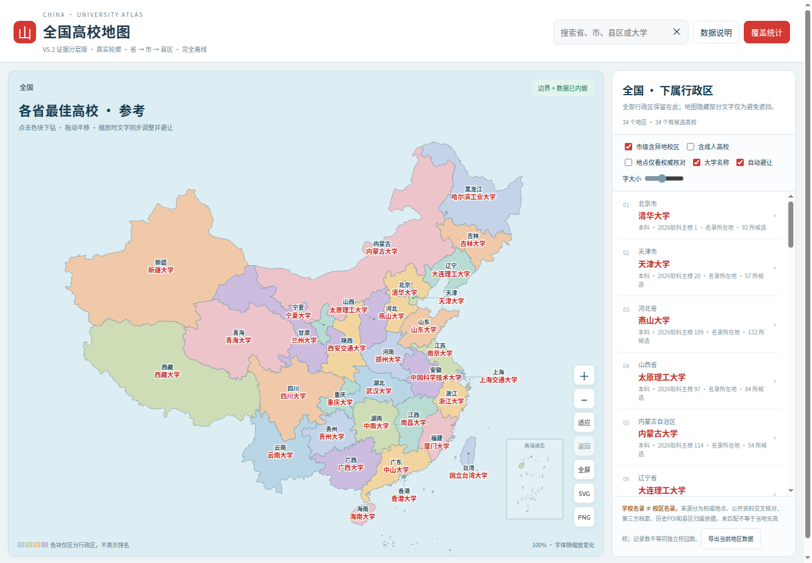

# 全国高校离线地图 · China University Atlas

真实行政区轮廓，**全国 → 省 → 市 → 县区**逐级查看；学校主体与校区分开建模，同一大学可以跨县区、跨城市出现。

**[下载离线 HTML](https://github.com/ProfessorZhi/china-university-atlas/releases/latest/download/china-university-atlas.html)** · **[版本与完整数据包](https://github.com/ProfessorZhi/china-university-atlas/releases)** · [数据来源](data/sources.json) · [覆盖与缺口](reports/coverage.json)

下载 HTML 后用现代浏览器直接打开，不需要服务器、账号、API 密钥或首次联网。地图边界、脚本、样式和运行数据全部内嵌；系统字体不随文件分发。GitHub 文件预览不是网页运行入口，请下载 HTML。



## 当前版本与范围

V5.2.0 在 V5.1 仓库基线上继续补地点数据，并新增 **县区归属证据层**：只有县区字段、没有校园门牌的资料不再伪装成“校区”。该证据可让县区地图显示候选学校，但不会生成校园坐标，也不会计入校区记录。V5.1 的 Windows 迁移完整性记录仍保存在 [migration-verification.json](reports/migration-verification.json)。

| 内容 | 当前快照 |
|---|---:|
| 普通高校主体 / 成人高校主体 | 2,952 / 244 |
| 校区、办学地点记录 | 6,773 |
| 有至少一个地点关联的普通高校 | 2,893 |
| 仍无具体地点 / 只有市级地点的普通高校 | 59 / 152 |
| 有校园地点的县区 / 有候选证据的县区 / 源县区轮廓 | 1,202 / 1,208 / 2,840 |
| 权威地点依据 / 县区归属依据 / 第三方档案 / 历史位置 | 50 / 33 / 4,864 / 1,856 |

本轮证据分层和新增地点详见 [V5.2 说明](docs/v5.2.md)。

数据日期为 2026-09-08；学校主体来自教育部 2026 名录的 CSV 镜像。**地点记录数不等于互不重复的独立校园数。** V5.2 另有 33 条县区归属依据，其中 2 条为政府公开县区依据，它们明确不属于校园地址。权威地点关联也不表示精确坐标、现用状态、招生专业和招生层次全部核验。港澳台学校名录、台湾市县轮廓尚未系统补全；不设普通县区的城市保留源数据可用的本级轮廓。

“最佳高校”是当前资料与默认排序规则下的参考候选，不是官方评定：本科优先、专科补位；再按学校标签和排名来源顺序排序。分类榜不等于统一全国排名，无排名时名称排序不能代表质量。省级按名录所在地；市级可切换是否含异地校区；县区按实际地点归属。学校整体排名不代表每个校区教学质量。

## 目录与修改方式

- `src/`：HTML 模板、样式与交互脚本；`dist/`：可直接使用的离线 HTML。
- `data/universities.jsonl`、`data/campuses.jsonl`：每行一个实体；`uid` 关联学校 `id`。`data/district-associations.jsonl` 单独保存县区归属证据，不允许包含校园地址或经纬度。`regions.json`、`metadata.json` 与边界压缩文件共同组成地图数据。
- `data/overrides/`：更名与官网核对依据；`data/sources/`：名录、排名字段及精简地址档案快照，不收录第三方长篇学校介绍。
- `reports/`：覆盖数量、缺失学校、仅定位到城市、待核地址、合并隔离记录和测试结果。
- `archive/windows-v5/`：迁移时保留的历史构建管线，供审计；当前正常构建以 `scripts/build.py` 为准。

修改 `data/` 或 `src/`，更新对应来源、统计与版本，然后执行：

```bash
python3 scripts/build.py
python3 scripts/validate.py
python3 scripts/build.py --check
node tests/browser.mjs  # 可选；Node.js 22+，已安装 Chrome，可设置 CHROME_BIN
python3 scripts/build.py --zip
```

常规构建仅用 Python 标准库、无网络；同一组输入产生同一 HTML。CI 检查数据、隐私扫描与重建一致性。缺坐标不填县城中心点；缺地点不标成“当地无高校”；新增校区必须保留来源与核验状态；只有县区线索时写入 association 层，不能冒充 campus。详见 [AGENTS.md](AGENTS.md)、[数据使用说明](NOTICE.md) 和 [迁移说明](docs/migration.md)。
