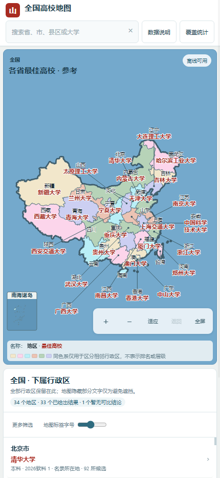

# 全国高校离线地图 · China University Atlas

真实行政区轮廓，**全国 → 省 → 市 → 县区**逐级查看；学校主体与校区分开建模，同一大学可以跨县区、跨城市出现。

**[下载离线 HTML](https://github.com/ProfessorZhi/china-university-atlas/releases/latest/download/china-university-atlas.html)** · **[版本与完整数据包](https://github.com/ProfessorZhi/china-university-atlas/releases)** · [数据来源](data/sources.json) · [覆盖与缺口](reports/coverage.json)

下载 HTML 后用现代浏览器直接打开，不需要服务器、账号、API 密钥或首次联网。地图边界、脚本、样式和运行数据全部内嵌；系统字体不随文件分发。GitHub 文件预览不是网页运行入口，请下载 HTML。


*同一张地图在 430×932 手机上：地图仍是主体，次要筛选折进“更多筛选”，五个数据范围开关展开后与桌面端完全一致。*



## 当前版本与范围

**V5.8 的最后一轮是“地图主导”改版：让地图成为首页主角，让标签长在行政区里面。** 第一轮修的是可读性下限，第二轮不再做局部 polish，而是重排版式、重画配色与边界、重写标签的放置优先级。**版式**上拆掉三处叠加的挤压——右栏 326 → 292px、header 从三行压成一行（80 → 53px）、地图卡的高度从写死的 `calc(100dvh - 172px)` 改为**由浏览器自己量**（桌面端 `body` 是 `height:100dvh` 的纵向 flex，`.shell` 取中间剩余的那条弹性行，卡片拉伸填满）——中间试过 `calc(100dvh - 103px)` 这种“手工减掉 chrome”的写法，在 Windows 下刚好，在 CI 的 Ubuntu 字体下每一条桌面路由都溢出 1px，于是彻底换成结构性的取用；陆地在桌面地图卡里占到 **85.7% 高度**（原 77.1%），全国层横向占内容区 **73.4%**（原 62.3%）。**配色**换成一组 6 色循环，用 CIEDE2000 在两两距离矩阵上做最远点插入 + 交换局部搜索、**最大化最小两两距离**（因为填色是贪心的，任意两项都可能相邻），最差一对从 11.3 拉到 **14.9**；新增门禁 `minAdjacentDE00`，594 对相邻行政区实测 **14.6**（门槛 12），同色相邻与近色相邻**各 0**。**边界**做成三级：当前层外轮廓最清楚、内部行政区界次之、无名细分边界最弱。**标签**是两级结构——行政区名深灰偏小、最佳高校名深红偏大，并且放置优先级第一次被**写成控制流**：`in place > beside it within the leash > name alone > anywhere`。第三步“只显示行政区名”现在排在“引线拉出去”之前，这正是手机全国层那个引线环的来源；同时给逃逸加了一条**皮带**（标签宽 ×0.8 / 58px 硬顶 / 地图宽 ×0.055 取最小，“旁边”是地图的比例而不是像素数，并且刻意**不**按行政区面积缩放——读者能跟住多长的线是屏幕上那根线的属性，不是它指向的多边形的属性）。**引线从 127 条降到 34 条**，桌面端除北京、上海两个中心城区极密的直辖市（3 条）与全国层的 2 条外**已无引线**：浙江省、广东省、江苏省、杭州市、深圳市在 1440×900 上的区内放置率都是 **1.0000**、引线 **0**。代价是诚实的：`silentOnAnswer` 从 5 升到 15，即“行政区名在区内、校名被拿掉”的情形变多（1440 上只有上海 `长宁区` 一个，它在整张图上最近的空位在 161px 之外，按优先级就该只留区名而不是牵一根横穿半个上海的线）。测试同步补上 `byLevelMobile`——原来的分档统计被刻意限制在 1440×900，**手机上的引线环因此完全测不到**，藏了整整一轮；`silentOnAnswer` 的门禁也随之从“1440 下每个胜者都要被画出来”改成可从 DOM 验证的那一半：**退化成只显示区名时，区名必须仍落在自己的形状里且不挂引线**，并用“占本路由单元数的比例 >10%”兜住大面积退化。

**V5.8 第一轮是视觉与标签可读性专项。** 只改呈现层——高校主体数据、campus 数据、排名事实、Best University 语义与 `src/winner-core.js` 判定原则**一行未动**，`tests/best-university-parity.mjs` 的 `problemCount: 0` 是这件事的证据。这一轮把地图从“数据工程项目的附属 UI”做成能直接交给普通读者的地图：地图标签不再小于 UI 里最不重要的文字（低于可读下限的字号标签 **44 → 0**），行政区名与最佳高校名成为两档有明文、有图例、有对比度下限的层级；“最佳高校”标签若用引线连回自己的色块，这条引线就必须真的看得见（实测 **4.44:1**，旧值是混合后 **1.73:1** 的灰影），否则它不会被算作已标注。标签互不重叠、不被画布裁切、不被地图标题/控件/图例/模式徽标遮挡三条断言均为 **0**，并作为 CI 门禁。移动端修掉了一处把地区列表挤到折线以下的回归（筛选条 **157px → 59px**）与两处 UI 互相重叠（图例 × 缩放控件 **56×25**、图例 × 南海诸岛 inset **58×13**）。**中文校名不再在词中断行**：行分割改按词而不按字，`职业技术大学`/`师范大学`/`商学院`/`大学`/`学院` 等 29 类结构词整块不可拆，切分点由“行宽方差最小”的动态规划决定，所以 `浙江工商大学杭州商学院` 得到的是 `浙江工商大学 / 杭州商学院`；实在放不下时退回**只显示地区名**，而不是劈开 `大学`。这一条有**不依赖系统字体**的断言守护（用合成度量驱动排版器，全量 3 230 个校名/地区名 × 3 个预算共 9 690 组，0 失败），不会因为 CI 装不装中文字体而改变结论。**全国主图的绘制几何也第一次被约束在拟合框内**：以前纬度 18° 以南只被排除在缩放范围之外、却被照常画出来，于是海南省的轮廓被画框底边硬切；现在拟合与绘制读同一个阈值，主图底边干净，南海信息交给“南海诸岛”插图。**已知未闭合项逐条写在验收文档里**——包括手机全国层仍有单元拿不到标签、手机全国层的引线仍然偏多（430×932 有 14 条，本轮已从 38 压到 27）。地图上没有“你在哪个单元里面”的外轮廓这一条**已在第二轮闭合**。

**V5.7 是 Standalone Offline Edition。** 保持“一个 HTML、双击即用、`file://`、0 HTTP、无需本地服务器”的前提下，把高校运行数据与行政区边界都以确定性 gzip + base64 形式内嵌，浏览器启动时用原生 `DecompressionStream` 本地解压；解压完成后主动释放 DOM 中的 base64 文本副本。V5.6 的单 HTML 为 **16,772,793 bytes**，V5.7 前端完成后为约 **3.70 MB**，数据、边界、排名事实与 Best University 规则没有删减；CI 另设 **5,000,000 bytes** 的单文件体积回归预算。桌面与移动端同时重做了地图控制、触摸目标、筛选条、启动状态、ARIA/focus 与 reduced-motion 体验。

V5.6 已把“最佳高校”从页面里的一个**隐式排序**变成一个有版本、有字段、可离线复现、**可被审计**的判定：判定只在 `src/winner-core.js` 里做一次，页面与覆盖审计调用同一个函数，`tests/best-university-parity.mjs` 断言两者永不背离——不仅断言赢家 uid 与状态，也断言地图上印出的**名次标签与审计 CSV 的 `ranking_display` 逐字符相同**。软科 2026 全部官方榜单继续作为冻结的版本化事实层使用。

| 内容 | 当前快照 |
|---|---:|
| 普通高校主体 / 成人高校主体 | 2,952 / 244 |
| 活跃普通高校 / 已解析失活普通高校 | 2,934 / 18 |
| 校区、办学地点记录 | 6,820 |
| 活跃普通高校缺任何地点证据 / 无 campus 记录 | 0 / 0 |
| campus 已到最低法定边界 / 仍仅城市级（HARD-BLOCKED） | 6,536 / 284 |
| 有具体校园地点的县区 / 有候选证据的县区 / 源县区轮廓 | 1,244 / 1,247 / 2,840 |
| 县区归属证据 / 待补新设行政区边界学校 | 35 / 2 |
| 排名事实 / 覆盖学校 | 2,502 / 2,483 |
| 审计单元（国/省/市/区县）/ 其中有候选 | 3,246 / 1,598 |

“最佳高校”判定结果（每个有候选单元都被判定，无漏判）：

| 分层 | 有候选 | `resolved_strong` | `resolved_policy` | `unresolved_incomparable` |
|---|---:|---:|---:|---:|
| 全国 | 1 | 1 | 0 | 0 |
| 省 | 31 | 30 | 0 | 1 |
| 市 | 346 | 71 | 240 | 35 |
| 区县 | 1,220 | 280 | 855 | 85 |
| **合计** | **1,598** | **382** | **1,095** | **121** |

`resolved_strong` 依赖官方可比名次；`resolved_policy` 依赖**显式政策**（唯一候选 / 本科>专科 / 校区优先 / 公办优先 / 唯一被覆盖）；`unresolved_incomparable` 是**刻意不下结论**——领先候选落在不可比的两把尺上（不同榜单体系之间没有发布方可换算关系），此时报告与地图都**不产出赢家**，也不回退到中文名排序。当前 **legacy 赢家 = 0、名称兜底赢家 = 0、未经审计的赢家 = 0**。

前端与打包变化详见 [V5.8 验收文档](docs/v5.8.md)（含 Before/After、测试矩阵、视觉决策与**已知未闭合项**）与 [V5.7 说明](docs/v5.7.md)；Best University 语义见 [V5.6 说明](docs/v5.6.md) 与 [独立复核](docs/v5.6-redteam.md)；地点证据分层见 [V5.2 说明](docs/v5.2.md)。

数据日期为 2026-09-09（排名事实 2026 软科）；学校主体来自教育部 2026 名录的 CSV 镜像。**地点记录数不等于互不重复的独立校园数。** 2,934 所活跃普通高校在**学校层**已无“缺任何地点证据”（0 所）与“无 campus 记录”（0 所）；其中 **2,912 所有最低法定行政边界级证据**，而 `ordinarySchoolsOnlyCityLocation` 为 **23 所**（两个口径都按学校计且互有交叠，不能相减当作 2,934 的拆分）。当前 284 条仅到城市层级的 campus 记录属于**记录级**精度债务，已在 V5.5 逐条穷尽为 `HARD-BLOCKED`（成因多为合并办学、无独立门牌或多校区共用地址），并不表示 284 所学校仍只有市级位置。草湖市、新星市两项属于离线底图尚未包含新设法定边界，不是学校位置缺失。

排名口径：软科主榜与各分类榜、民办榜、高职榜**之间没有发布方的换算关系，不互相比较裸名次**。`ranking` 与 `rankOverall` 含义随榜单而变——分类榜与高职总榜的 `ranking` 是**类别内名次**，`rankOverall` 才是主榜/总榜参考，显示时按当前尺度标注。`500+` / `100+` / `80+` / `20+` 是**开放区间不是数值**，区间之间不排序，区间与落在其内的精确名次之间也不排序。旧版 `universities.rank` 是历史展示顺序，**不是官方名次**，既不作赢家也不作排序键。省级按学校主体所在地；**城市主榜只允许本地主体高校参与**，异地本科校区/分校与研究生院/研究院只作为附加 presence 展示；县区按实际地点归属，**有校区候选时不得让仅县区归属证据的候选胜出**。开启“包含异地办学”后，有异地 presence 的城市会在本地主体高校名后显示 `＋`，悬浮查看分层信息，但不会改变本地主榜候选。学校整体排名不代表每个校区教学质量。

## 单文件离线实现

- `schoolData`：完整运行数据在构建时使用确定性 gzip 压缩后 base64 内嵌；仓库中的 JSONL/CSV/审计数据仍保留全量、可读版本。
- `geoData`：全国行政区 compact geometry 同样以 gzip + base64 内嵌。
- 浏览器端：只使用浏览器原生 `DecompressionStream('gzip')`，不加载第三方解压库；解压完成后清空对应 `<script>` 的 base64 文本，减少长会话中的重复内存占用。
- CSP 明确 `connect-src 'none'`；离线 browser test 同时断言 `0 HTTP request` 与 `0 runtime error`。
- `scripts/profile_offline_bundle.py` 记录 HTML、schoolData、geometry、JS/CSS 的字节构成，并把单 HTML 上限守在 5 MB。
- 建议使用近期版本 Chrome / Edge / Firefox / Safari；不支持 `DecompressionStream` 的旧浏览器会给出明确错误提示，而不会静默联网回退。

## 目录与修改方式

- `src/`：HTML 模板、样式与交互脚本；`dist/`：可直接使用的离线 HTML。
- `data/universities.jsonl`、`data/campuses.jsonl`：每行一个实体；`uid` 关联学校 `id`。`data/district-associations.jsonl` 单独保存县区归属证据，不允许包含校园地址或经纬度。`data/city-affiliates.json` 保存城市异地办学 presence；`data/*facts*`、`data/rankings.jsonl` 等保存版本化事实。`regions.json`、`metadata.json` 与边界压缩文件共同组成地图数据。
- `data/overrides/`：更名与官网核对依据；`data/sources/`：名录、排名字段及精简地址档案快照，不收录第三方长篇学校介绍。
- `reports/`：确定性的覆盖数量、缺失学校、城市级记录、待核地址、状态与事实表；`offline-bundle-profile.json` 记录单文件体积构成。浏览器断网测试报告属于 CI 运行产物，在 Actions artifact 中保存，不作为长期提交快照。
- `archive/windows-v5/`：迁移时保留的历史构建管线，供审计；当前正常构建以 `scripts/build.py` 为准。

修改 `data/` 或 `src/` 后，先生成派生表，再构建和验证：

```bash
python3 scripts/generate_reports.py
python3 scripts/build.py
python3 scripts/profile_offline_bundle.py             # 单文件体积构成 + 5 MB 回归预算
node scripts/generate_best_university_coverage.mjs   # 覆盖审计；以 build 产物为输入
python3 scripts/validate.py
python3 scripts/validate_facts.py
python3 scripts/generate_reports.py --check
node scripts/generate_best_university_coverage.mjs --check
python3 scripts/build.py --check
node tests/best-university-parity.mjs  # 可选：审计 ↔ UI 一致性
node tests/browser.mjs                 # 可选；Node.js 22+，已安装 Chrome，可设置 CHROME_BIN
python3 scripts/build.py --zip
```

`generate_best_university_coverage.mjs` 以**构建产物**为输入（判定来自 `dist/` 解压后的 `schoolData`），所以它排在 `build.py` 之后；它自身带结构性守卫，任何违反（赢家缺地点依据、区县赢家只靠县区归属、未决单元却有赢家等）都会**直接让生成失败**，而不是产出看起来正常的报告。

常规构建仅用 Python 标准库、无网络；同一组输入产生同一 HTML。CI 检查派生表一致性、数据与事实层、隐私扫描、体积预算、离线浏览器行为、Best University parity 和重建一致性。缺坐标不填县城中心点；缺地点不标成“当地无高校”；新增校区必须保留来源与核验状态；只有县区线索时写入 association 层，不能冒充 campus；异地办学实体不能冒充城市本地主体高校。详见 [AGENTS.md](AGENTS.md)、[数据使用说明](NOTICE.md) 和 [迁移说明](docs/migration.md)。